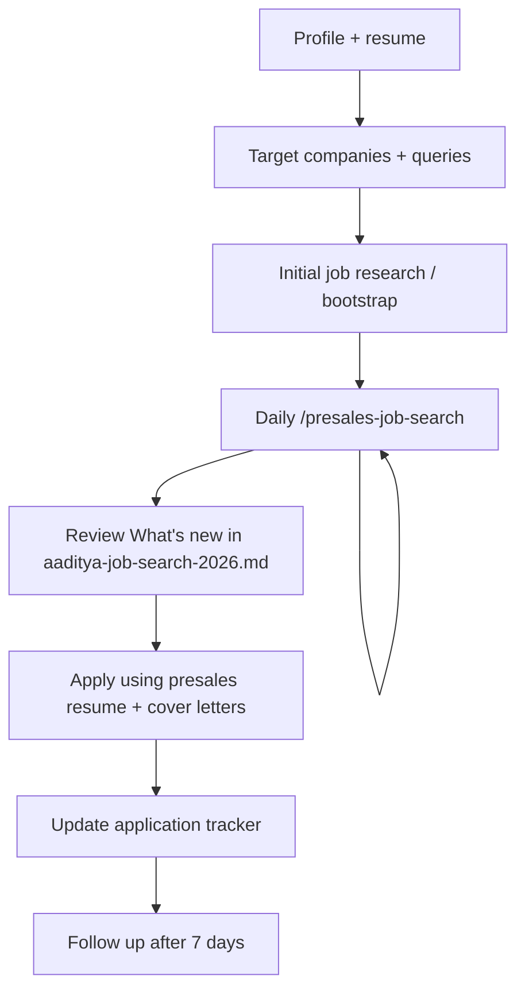
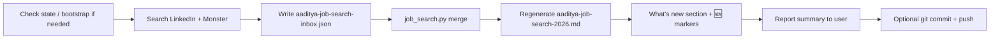

# grok-workspace

Career transition toolkit for **Aaditya Ghosalkar** — targeting pre-sales, sales engineering, and associate solution architect roles in cloud and AI.

**Profile:** ~2 YOE · UVA CS · AWS SAA + AI Practitioner · GenAI + multi-cloud · Open to relocate anywhere in the US

**Remote:** [github.com/gneelesh/grok-workspace](https://github.com/gneelesh/grok-workspace)

---

## End-to-end process

This repo supports a repeatable job-search workflow: position the profile, maintain search queries, run a daily automated scan, review new postings, apply, and track follow-ups.



| Phase | What to use | Outcome |
|---|---|---|
| **1. Position** | `aaditya-sales-profile-study.md`, `aaditya-presales-resume.md` | Pre-sales narrative and tailored resume |
| **2. Target** | `aaditya-target-companies-and-portals.md`, `aaditya-job-search-queries.md` | Employer list + LinkedIn/Monster search strings |
| **3. Collect** | `/presales-job-search` (daily) | Live listings in `aaditya-job-search-2026.md` |
| **4. Apply** | `aaditya-cover-letters-top5.md`, `Aaditya_Ghosalkar_Resume.pdf` | Submissions to priority roles |
| **5. Track** | `aaditya-application-tracker.md` | Status, dates, follow-ups |

---

## Repository contents

| File | Purpose |
|---|---|
| `Aaditya_Ghosalkar_Resume.pdf` | Original builder-focused resume |
| `aaditya-presales-resume.md` | Pre-sales repositioned resume |
| `aaditya-sales-profile-study.md` | Career analysis, fit matrix, 90-day action plan |
| `aaditya-target-companies-and-portals.md` | Target employers and job boards |
| `aaditya-job-search-queries.md` | LinkedIn alerts and Monster Boolean strings |
| `aaditya-job-search-2026.md` | **Live job listings** — updated in place each run |
| `aaditya-job-search-state.json` | Job URL tracker (`first_seen`, `last_seen`, run history) |
| `aaditya-job-search-inbox.json` | Staging file for each day's search results |
| `aaditya-application-tracker.md` | Application status and follow-up tracker |
| `aaditya-cover-letters-top5.md` | Tailored cover letters for priority roles |

---

## Daily job search (automated skill)

A Grok skill searches LinkedIn and Monster each day, merges results into the same markdown file, and highlights **new** postings only.

### Run it

In Grok:

```
/presales-job-search
```

Or ask: *"run daily job search"*, *"refresh job listings"*, *"update job search"*

The skill is project-scoped at `.grok/skills/presales-job-search/` and appears in the slash menu as **`presales-job-search`**.

### What happens each run



| Step | Action |
|:---:|---|
| 0 | Run `job_search.py status` — bootstrap from markdown if `total_jobs` is 0 |
| 1 | Search LinkedIn (4 passes) and Monster.com (see coverage below) |
| 2 | Write all found jobs to `aaditya-job-search-inbox.json` |
| 3 | Run `job_search.py merge` — compares URLs against `aaditya-job-search-state.json` |
| 4 | Regenerate `aaditya-job-search-2026.md` with **What's new** at the top |
| 5 | Summarize new count + list new companies for the user |
| 6 | Commit and push (when requested) |

### Search coverage (each daily run)

Read `aaditya-job-search-queries.md` and `.grok/skills/presales-job-search/references/search-workflow.md` for full agent instructions.

1. **LinkedIn remote** — cloud SE + AI/GenAI (Alerts 1–2)
2. **Non-Big-3 vendors** — Oracle, IBM, Red Hat, Nutanix (Alert 3)
3. **Hub cities** — NYC, Austin, Raleigh, SF Bay, Chicago, Atlanta, Boston, Dallas, Denver, Seattle (Alerts 5–6)
4. **Monster.com** — sales engineer / presales / cloud

Target **40–60 relevant roles** per run. Include both newly discovered postings and previously tracked jobs still active (so `last_seen` stays current).

### Role filtering

**Include:** Sales Engineer, Solutions Engineer, Presales, Solutions Consultant, Associate SA, Cloud Consultant, Client Engineering, Customer Success Engineer (technical), Technical Sales Specialist

**Exclude:** Principal, Distinguished, Staff, Director, VP, BDR, SDR, pure AE, IT Support Engineer

| Signal | `section` value in inbox JSON |
|---|---|
| 0–3 YOE, entry-level, campus 2026 | `apply_first` |
| SHI, Arrow, CDW, WWT, Rackspace, partner | `channel_partners` |
| AI, GenAI, LLM, ML, data platform | `ai_genai` |
| NYC, NJ, New York | `hub_nyc` |
| Austin, Dallas, Houston, Texas | `hub_austin` |
| Raleigh, Charlotte, NC | `hub_raleigh` |
| SF, Bay Area, San Jose | `hub_sf` |
| Chicago | `hub_chicago` |
| Atlanta | `hub_atlanta` |
| Boston, Denver, Seattle | `hub_boston` |
| monster.com URL | `monster` |
| 5+ years required, senior only | `stretch` |

### How new jobs are highlighted

Jobs are keyed by **URL** — the same posting is never marked new twice.

| Marker | Meaning |
|---|---|
| **What's new — [date]** section at top | All postings first seen on the latest run |
| 🆕 **Company** in tables | Same job — new since previous run |
| No marker | Seen in an earlier run (still listed) |

After the next day's run, yesterday's 🆕 markers disappear from tables (jobs remain listed but are no longer "new").

**First run note:** The baseline bootstrap on 2026-06-28 marked all 69 initial jobs as 🆕. From the second run onward, only genuinely new URLs are highlighted.

### Inbox JSON format

The agent writes search results to `aaditya-job-search-inbox.json` before running merge:

```json
{
  "search_date": "2026-06-28",
  "jobs": [
    {
      "company": "IBM",
      "description": "Customer Success Engineer — Entry Level 2026 (McLean, VA). Deliver POCs, demos, workshops.",
      "url": "https://www.linkedin.com/jobs/view/customer-success-engineer-entry-level-sales-program-2026-at-ibm-4427386901",
      "link_text": "Apply on LinkedIn",
      "section": "apply_first"
    }
  ]
}
```

**Rules:**
- `url` is the unique key — use the full LinkedIn or Monster job view URL
- `description` = 1–3 sentences (title, location, fit note)
- Deduplicate by URL before writing
- Include re-found existing jobs **and** new jobs in the same inbox

---

## Manual commands

From the workspace root:

```powershell
cd C:\Users\neele\grok-workspace

# Check tracker status
python .grok/skills/presales-job-search/scripts/job_search.py status

# Re-import jobs from markdown (first-time setup)
python .grok/skills/presales-job-search/scripts/job_search.py bootstrap

# Merge inbox after a manual search
python .grok/skills/presales-job-search/scripts/job_search.py merge

# Regenerate markdown from state only
python .grok/skills/presales-job-search/scripts/job_search.py render
```

### Troubleshooting

| Issue | Fix |
|---|---|
| `inbox not found` | Write `aaditya-job-search-inbox.json` before running `merge` |
| Duplicate companies in tables | OK — URL is the unique key |
| LinkedIn fetch fails | Use web search snippets; still capture the job URL |
| Monster blocks JS fetch | Use search result title + URL; note "verify on Monster" in description |
| Manual markdown edits | Avoid — they break state sync; always use `merge` / `render` |

### Do not

- Create a new dated file each day — always update `aaditya-job-search-2026.md`
- Delete jobs from state unless explicitly asked — keep historical listings
- Skip the merge script after a search run

---

## Weekly application workflow

| Day | Task |
|---|---|
| **Daily** | Run `/presales-job-search` — review **What's new** section |
| **Mon–Fri** | Apply to 1–2 roles from `aaditya-application-tracker.md` |
| **Per apply** | Send `aaditya-presales-resume.md` (or PDF) + adapted cover letter |
| **After apply** | Update tracker: `date_applied`, `status`, link |
| **+7 days** | Follow up if no response (LinkedIn message to recruiter) |

### Priority applications (week 1)

1. **IBM** — Customer Success Engineer, Entry Level 2026 (McLean)
2. **Cync Software** — Solution Engineer, Fintech (Herndon; 0–2 YOE)
3. **Bitwarden / AuthZed** — Remote Solutions Engineer
4. **SHI** — Presales Solutions Engineer, Data Protection (stretch at 3+ yrs)
5. **Salesforce** — Solution Engineer, All Levels (NYC)

Cover letter drafts for the top five are in `aaditya-cover-letters-top5.md`.

---

## Skill files (for developers)

```
.grok/skills/presales-job-search/
├── SKILL.md                      # Grok agent instructions (5-step workflow)
├── scripts/
│   └── job_search.py             # bootstrap · merge · render · status
└── references/
    └── search-workflow.md        # Daily search passes, filters, inbox schema
```

---

## Git

```powershell
git status
git add README.md aaditya-job-search-2026.md aaditya-job-search-state.json aaditya-job-search-inbox.json
git commit -m "Your message"
git push
```

Daily search commit message format:

```
Daily presales job search YYYY-MM-DD: N new
```

---

## Quick links

- [LinkedIn — Presales Solutions Architect (US)](https://www.linkedin.com/jobs/presales-solutions-architect-jobs)
- [LinkedIn — Solutions Engineer Remote + GenAI](https://www.linkedin.com/jobs/search/?keywords=%22solutions%20engineer%22%20generative%20OR%20genai&location=United%20States&f_WT=2)
- [Monster — Sales Engineer](https://www.monster.com/jobs/q-sales-engineer-jobs)
- [PreSales Collective](https://www.presalescollective.com/jobs)