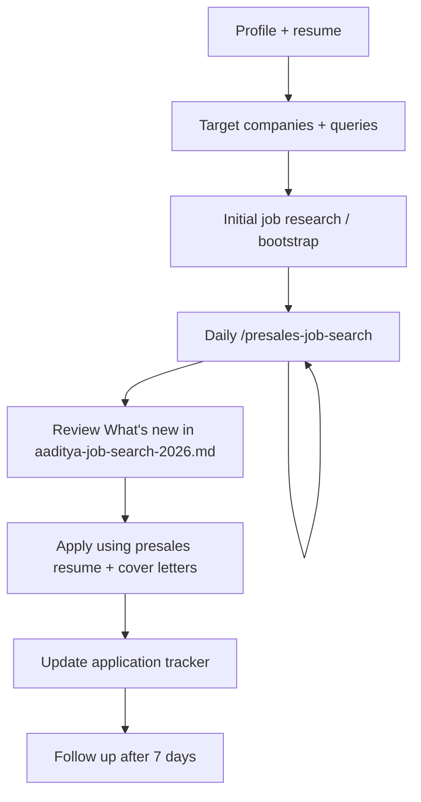
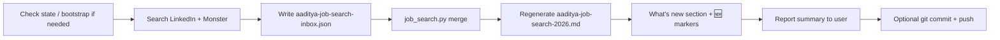

# grok-workspace

Career transition toolkit for **Aaditya Ghosalkar** — targeting pre-sales, sales engineering, and associate solution architect roles in cloud and AI.

**Profile:** ~2 YOE · UVA CS · AWS SAA + AI Practitioner · GenAI + multi-cloud · Open to relocate anywhere in the US

**Remote:** [github.com/gneelesh/grok-workspace](https://github.com/gneelesh/grok-workspace)

---

## What to run

Two independent search tracks share one engine. Each keeps its own state, inbox, and output file — running one never touches the other.

| Track | Roles | Ask for it | Output |
|---|---|---|---|
| **Presales** | Sales Engineer · Solutions Consultant · Presales · Associate SA | `/presales-job-search`, or *"run daily job search"* | `aaditya-job-search-2026.md` |
| **AI Engineer** | AI Engineer · Forward Deployed AI Engineer · AI/Python Engineer · LLM/GenAI Engineer | *"read `claude-ai-engineer.md` and run it"* | `ai-engineer-jobs-2026.md` |

Run either daily. Both prune closed listings before and after searching, then mark genuinely new postings with 🆕.

**The AI Engineer track requires `JOB_TRACK_CONFIG` on every command** — without it the script writes to the presales files:

```bash
export JOB_TRACK_CONFIG=ai-engineer-track.json
```

---

## End-to-end process

This repo supports a repeatable job-search workflow: position the profile, maintain search queries, run a daily automated scan, review new postings, apply, and track follow-ups.


```mermaid
flowchart TD
    A[Profile + resume] --> B[Target companies + queries]
    B --> C[Initial job research / bootstrap]
    C --> D[Daily /presales-job-search]
    D --> E[Review What's new in aaditya-job-search-2026.md]
    E --> F[Apply using presales resume + cover letters]
    F --> G[Update application tracker]
    G --> H[Follow up after 7 days]
    D --> D
```

| Phase | What to use | Outcome |
|---|---|---|
| **1. Position** | `aaditya-sales-profile-study.md`, `aaditya-presales-resume.md` | Pre-sales narrative and tailored resume |
| **2. Target** | `aaditya-target-companies-and-portals.md`, `aaditya-job-search-queries.md` | Employer list + LinkedIn/Monster search strings |
| **3. Collect** | `/presales-job-search` (daily) | Live listings in `aaditya-job-search-2026.md` |
| **4. Apply** | `aaditya-cover-letters-top5.md`, `Aaditya_Ghosalkar_Resume.pdf` | Submissions to priority roles |
| **5. Track** | `aaditya-application-tracker.md` | Status, dates, follow-ups |

---

## Repository contents

| File | Purpose |
|---|---|
| `Aaditya_Ghosalkar_Resume.pdf` | Original builder-focused resume |
| `aaditya-presales-resume.md` | Pre-sales repositioned resume |
| `aaditya-sales-profile-study.md` | Career analysis, fit matrix, 90-day action plan |
| `aaditya-target-companies-and-portals.md` | Target employers and job boards |
| `aaditya-job-search-queries.md` | LinkedIn alerts and Monster Boolean strings |
| `aaditya-job-search-2026.md` | **Live job listings** — updated in place each run |
| `aaditya-job-search-state.json` | Job URL tracker (`first_seen`, `last_seen`, run history) |
| `aaditya-job-search-inbox.json` | Staging file for each day's search results |
| `aaditya-application-tracker.md` | Application status and follow-up tracker |
| `aaditya-cover-letters-top5.md` | Tailored cover letters for priority roles |
| `claude-ai-engineer.md` | **AI Engineer track workflow** — search passes, Boolean strings, filters |
| `ai-engineer-track.json` | AI Engineer track config (output paths, section headings) |
| `ai-engineer-jobs-2026.md` | **Live AI Engineer listings** — updated in place each run |
| `ai-engineer-state.json` | AI Engineer job URL tracker |
| `ai-engineer-inbox.json` | Staging file for each AI Engineer search run |

---

## Daily job search (automated skill)

A Grok skill searches LinkedIn and Monster each day, merges results into the same markdown file, and highlights **new** postings only.

### Run it

In Grok:

```
/presales-job-search
```

Or ask: *"run daily job search"*, *"refresh job listings"*, *"update job search"*

The skill is project-scoped at `.grok/skills/presales-job-search/` and appears in the slash menu as **`presales-job-search`**.

### What happens each run


```mermaid
flowchart LR
    A[Check state / bootstrap if needed] --> B[Search LinkedIn + Monster]
    B --> C[Write aaditya-job-search-inbox.json]
    C --> D[job_search.py merge]
    D --> E[Regenerate aaditya-job-search-2026.md]
    E --> F[What's new section + 🆕 markers]
    F --> G[Report summary to user]
    G --> H[Optional git commit + push]
```

| Step | Action |
|:---:|---|
| 0 | Run `job_search.py status` — bootstrap from markdown if `total_jobs` is 0 |
| 1 | Search LinkedIn (4 passes) and Monster.com (see coverage below) |
| 2 | Write all found jobs to `aaditya-job-search-inbox.json` |
| 3 | Run `job_search.py merge` — compares URLs against `aaditya-job-search-state.json` |
| 4 | Regenerate `aaditya-job-search-2026.md` with **What's new** at the top |
| 5 | Summarize new count + list new companies for the user |
| 6 | Commit and push (when requested) |

### Search coverage (each daily run)

Read `aaditya-job-search-queries.md` and `.grok/skills/presales-job-search/references/search-workflow.md` for full agent instructions.

1. **LinkedIn remote** — cloud SE + AI/GenAI (Alerts 1–2)
2. **Non-Big-3 vendors** — Oracle, IBM, Red Hat, Nutanix (Alert 3)
3. **Hub cities** — NYC, Austin, Raleigh, SF Bay, Chicago, Atlanta, Boston, Dallas, Denver, Seattle (Alerts 5–6)
4. **Monster.com** — sales engineer / presales / cloud

Target **40–60 relevant roles** per run. Include both newly discovered postings and previously tracked jobs still active (so `last_seen` stays current).

### Role filtering

**Include:** Sales Engineer, Solutions Engineer, Presales, Solutions Consultant, Associate SA, Cloud Consultant, Client Engineering, Customer Success Engineer (technical), Technical Sales Specialist

**Exclude:** Principal, Distinguished, Staff, Director, VP, BDR, SDR, pure AE, IT Support Engineer

| Signal | `section` value in inbox JSON |
|---|---|
| 0–3 YOE, entry-level, campus 2026 | `apply_first` |
| SHI, Arrow, CDW, WWT, Rackspace, partner | `channel_partners` |
| AI, GenAI, LLM, ML, data platform | `ai_genai` |
| NYC, NJ, New York | `hub_nyc` |
| Austin, Dallas, Houston, Texas | `hub_austin` |
| Raleigh, Charlotte, NC | `hub_raleigh` |
| SF, Bay Area, San Jose | `hub_sf` |
| Chicago | `hub_chicago` |
| Atlanta | `hub_atlanta` |
| Boston, Denver, Seattle | `hub_boston` |
| monster.com URL | `monster` |
| 5+ years required, senior only | `stretch` |

### How new jobs are highlighted

Jobs are keyed by **URL** — the same posting is never marked new twice.

| Marker | Meaning |
|---|---|
| **What's new — [date]** section at top | All postings first seen on the latest run |
| 🆕 **Company** in tables | Same job — new since previous run |
| No marker | Seen in an earlier run (still listed) |

After the next day's run, yesterday's 🆕 markers disappear from tables (jobs remain listed but are no longer "new").

**First run note:** The baseline bootstrap on 2026-06-28 marked all 69 initial jobs as 🆕. From the second run onward, only genuinely new URLs are highlighted.

### Inbox JSON format

The agent writes search results to `aaditya-job-search-inbox.json` before running merge:

```json
{
  "search_date": "2026-06-28",
  "jobs": [
    {
      "company": "IBM",
      "description": "Customer Success Engineer — Entry Level 2026 (McLean, VA). Deliver POCs, demos, workshops.",
      "url": "https://www.linkedin.com/jobs/view/customer-success-engineer-entry-level-sales-program-2026-at-ibm-4427386901",
      "link_text": "Apply on LinkedIn",
      "section": "apply_first"
    }
  ]
}
```

**Rules:**
- `url` is the unique key — use the full LinkedIn or Monster job view URL
- `description` = 1–3 sentences (title, location, fit note)
- Deduplicate by URL before writing
- Include re-found existing jobs **and** new jobs in the same inbox

---

## AI Engineer track

Same engine, second track. Full instructions live in **`claude-ai-engineer.md`** — ask *"read `claude-ai-engineer.md` and run it"*.

### Search coverage (5 passes)

1. **Core AI Engineer** — remote US (`f_WT=2`)
2. **Forward Deployed** — Forward Deployed Engineer / Applied AI Engineer
3. **AI + Python** — AI Python Engineer / LLM Engineer / GenAI Engineer
4. **Hub cities** — SF Bay, NYC, Seattle, Austin, Boston, Denver
5. **Monster.com** — expect 403; fall back to web search

Prefer LinkedIn's guest job API — it returns real job cards without login, unlike plain web search which mostly returns aggregate listing pages:

```
https://www.linkedin.com/jobs-guest/jobs/api/seeMoreJobPostings/search?keywords=<terms>&location=<loc>&f_TPR=r604800&start=0
```

Parameters: `f_WT=2` remote · `f_E=2,3` entry/associate · `f_TPR=r604800` past week · `start=25` page 2.

### Role filtering

**Include:** AI Engineer · Applied AI Engineer · Forward Deployed (AI/Software) Engineer · AI/ML Engineer · LLM Engineer · GenAI Engineer · Machine Learning Engineer · Python Engineer with AI scope · MLOps / ML Platform Engineer

**Exclude:** Principal · Distinguished · Staff · Director · VP · Research Scientist (PhD-gated) · Data Analyst/Engineer with no AI scope · aggregator spam (Jobright.ai, "Jobs AI", Client Reach AI)

| Signal | `section` value |
|---|---|
| Entry/associate/new-grad, 0–3 YOE | `apply_first` |
| Forward deployed, field engineer, customer-facing AI | `fde` |
| Python-first application engineering with AI scope | `ai_python` |
| LLM / GenAI / agents / RAG product engineering | `genai_llm` |
| MLOps, model serving, GPU/inference infra | `ml_platform` |
| Remote-US with no specific hub | `remote` |
| SF · NYC · Seattle · Austin · Boston | `hub_sf` · `hub_nyc` · `hub_seattle` · `hub_austin` · `hub_boston` |
| monster.com URL | `monster` |
| Senior-only, 5+ years, research-heavy | `stretch` |

---

## Manual commands

From the workspace root (`python3` on Linux/macOS, `python` on Windows):

```bash
# --- Presales track (default) ---
python3 .grok/skills/presales-job-search/scripts/job_search.py status
python3 .grok/skills/presales-job-search/scripts/job_search.py prune           # remove closed listings
python3 .grok/skills/presales-job-search/scripts/job_search.py prune --dry-run # preview only
python3 .grok/skills/presales-job-search/scripts/job_search.py merge --prune-after
python3 .grok/skills/presales-job-search/scripts/job_search.py render          # regenerate markdown from state
python3 .grok/skills/presales-job-search/scripts/job_search.py bootstrap       # re-import from markdown

# --- AI Engineer track (same commands, one extra export) ---
export JOB_TRACK_CONFIG=ai-engineer-track.json
python3 .grok/skills/presales-job-search/scripts/job_search.py status
python3 .grok/skills/presales-job-search/scripts/job_search.py prune
python3 .grok/skills/presales-job-search/scripts/job_search.py merge --prune-after
```

Windows PowerShell sets the track with `$env:JOB_TRACK_CONFIG = "ai-engineer-track.json"` instead of `export`.

### How the two tracks stay separate

`job_search.py` reads its output path, state path, inbox path, title, and section headings from a **track config**. With no `JOB_TRACK_CONFIG` set it uses the built-in presales defaults; with it set, everything is redirected to that track's files. Adding a third track means writing one more `*-track.json` plus a workflow markdown — no changes to the script.

### Troubleshooting

| Issue | Fix |
|---|---|
| `inbox not found` | Write the track's inbox JSON before running `merge` |
| AI search wrote to the presales file | `JOB_TRACK_CONFIG` was not exported — re-export and re-run |
| Duplicate companies in tables | OK — URL is the unique key |
| LinkedIn fetch fails | Use the guest job API, or web search snippets; still capture the job URL |
| Monster blocks JS fetch (403) | Use search result title + URL; note "verify on Monster" in description |
| Manual markdown edits | Avoid — they break state sync; always use `merge` / `render` |
| Prune takes several minutes | Normal — ~2s per URL; `--delay=1.5` speeds it up (higher 429 risk) |

### Do not

- Create a new dated file each day — always update `aaditya-job-search-2026.md`
- Delete jobs from state unless explicitly asked — keep historical listings
- Skip the merge script after a search run

---

## Weekly application workflow

| Day | Task |
|---|---|
| **Daily** | Run `/presales-job-search` and the `claude-ai-engineer.md` workflow — review each **What's new** section |
| **Mon–Fri** | Apply to 1–2 roles from `aaditya-application-tracker.md` |
| **Per apply** | Send `aaditya-presales-resume.md` (or PDF) + adapted cover letter |
| **After apply** | Update tracker: `date_applied`, `status`, link |
| **+7 days** | Follow up if no response (LinkedIn message to recruiter) |

### Priority applications (week 1)

1. **IBM** — Customer Success Engineer, Entry Level 2026 (McLean)
2. **Cync Software** — Solution Engineer, Fintech (Herndon; 0–2 YOE)
3. **Bitwarden / AuthZed** — Remote Solutions Engineer
4. **SHI** — Presales Solutions Engineer, Data Protection (stretch at 3+ yrs)
5. **Salesforce** — Solution Engineer, All Levels (NYC)

Cover letter drafts for the top five are in `aaditya-cover-letters-top5.md`.

---

## Skill files (for developers)

```
.grok/skills/presales-job-search/
├── SKILL.md                      # Presales agent instructions (5-step workflow)
├── scripts/
│   ├── job_search.py             # bootstrap · merge · render · status · prune (both tracks)
│   └── prune_closed.py           # URL checker for closed listings
└── references/
    └── search-workflow.md        # Daily search passes, filters, inbox schema

claude-ai-engineer.md             # AI Engineer agent instructions
ai-engineer-track.json            # AI Engineer track config consumed by job_search.py
```

`job_search.py` is track-agnostic: `DEFAULT_TRACK` holds the presales settings, and `$JOB_TRACK_CONFIG` overrides any of them (`output_md`, `state_json`, `inbox_json`, `title`, `meta_lines`, `footer`, `hub_parent_heading`, `section_order`).

---

## Git

```bash
git status

# Presales run
git add aaditya-job-search-2026.md aaditya-job-search-state.json aaditya-job-search-inbox.json
git commit -m "Daily presales job search YYYY-MM-DD: N new, M pruned"

# AI Engineer run
git add ai-engineer-jobs-2026.md ai-engineer-state.json ai-engineer-inbox.json
git commit -m "Daily AI engineer job search YYYY-MM-DD: N new, M pruned"

git push
```

---

## Quick links

- [LinkedIn — Presales Solutions Architect (US)](https://www.linkedin.com/jobs/presales-solutions-architect-jobs)
- [LinkedIn — Solutions Engineer Remote + GenAI](https://www.linkedin.com/jobs/search/?keywords=%22solutions%20engineer%22%20generative%20OR%20genai&location=United%20States&f_WT=2)
- [Monster — Sales Engineer](https://www.monster.com/jobs/q-sales-engineer-jobs)
- [PreSales Collective](https://www.presalescollective.com/jobs)
- [LinkedIn — AI Engineer (Remote US)](https://www.linkedin.com/jobs/search/?keywords=%22AI%20Engineer%22&location=United%20States&f_WT=2)
- [LinkedIn — Forward Deployed Engineer](https://www.linkedin.com/jobs/search/?keywords=%22Forward%20Deployed%20Engineer%22&location=United%20States)